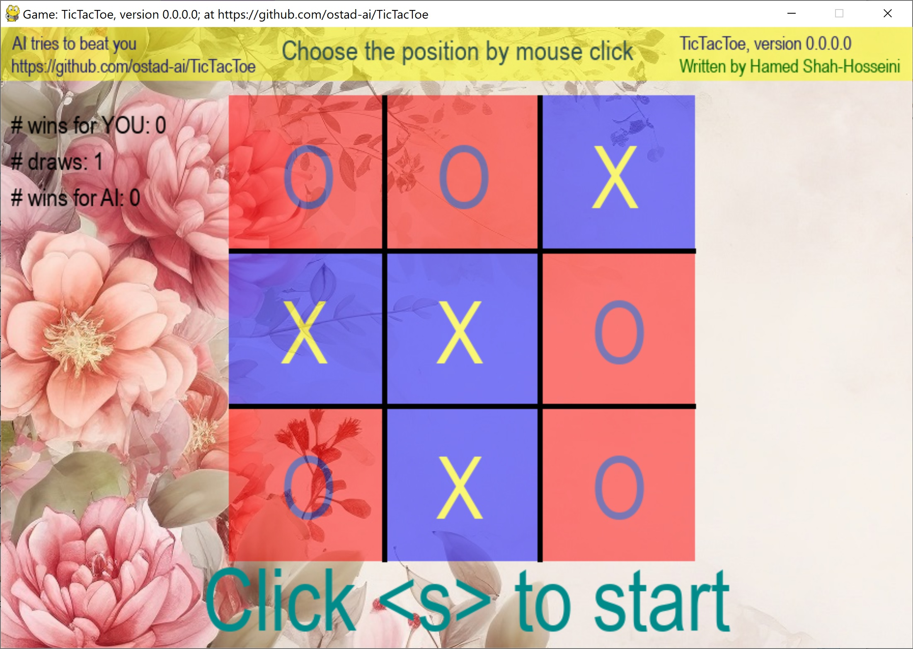

# TicTacToe
This is the well-known **tic-tac-toe** game that is played between two players. Here, AI plays the role of one player. You pick your choice by clicking on one of the nine cells that are empty. Then, the AI chooses a cell to win or hold you back from winning.
1. Start the game by clicking **s** on the keyboead.
2. Move the cursor by **Mouse wheel** or **touchpad** over the cells. Then, click by *mouse button* on your choice.
3. The game has a funny special effect for choosing a cell, winning, and losing.
## This archive includes the executable program: **tictactoe.exe**, which is suitable for **Windows 10** and over. You should click on the executable to run.
[Download the archive for win64](https://drive.google.com/file/d/1Mqgi24k7EguUTGpUjQXacwBdWyHO7-Ee/view?usp=sharing)
---
 *Figure 1: A snapshot of TicTacToe Game, version 0.0.0.0, while playing the game.*
---
